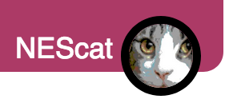
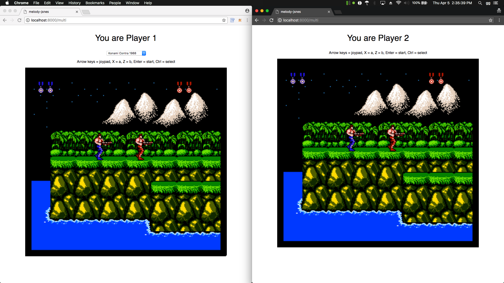
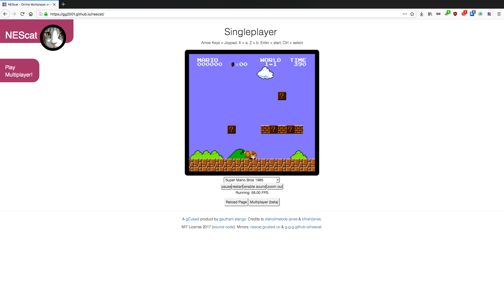

# NEScat

  

NEScat is a website to play NES or Nintendo Entertainment System games in a browser in singleplayer and online multiplayer modes with only JavaScript, no plugins necessary. It is based on [melody-jsnes by olahal](https://github.com/olahol/melody-jsnes) and [jsnes by bfirsh](https://github.com/bfirsh/jsnes). The server side components were programmed in Go with Gin handling the web aspects and Melody using websockets to allow multiplayer. A singleplayer only version can be found on [GitHub Pages](https://gg2001.github.io/nescat/).

## Usage

    $ git clone https://github.com/gg2001/nescat.git
    $ cd nescat
    $ git submodule update --init --recursive
    $ go get
    $ go build
    $ ./nescat
